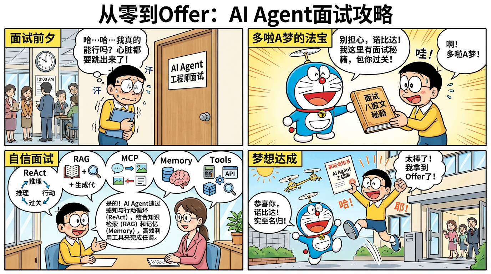

# AI Agent 面试全攻略 -- 从零到 Offer



> 面向小白的、最全最详细的 AI Agent 面试准备资料，包含面试八股文、企业级实战项目（Python/Java/Go 三版本）、简历模板、STAR 面试稿、漫画图解。

---

## 项目亮点

- **9 大模块面试八股文**：覆盖 Agent 基础、ReAct/Plan-and-Execute 框架、RAG、工具调用、记忆系统、多智能体、大模型基础、工程化实践、Prompt 工程，合计 **200+ 道面试题及详细答案**
- **企业级实战项目**：对标 nageoffer/ragent 的架构复杂度，Python / Java / Go 三个语言版本
- **完整面试闭环**：学习路线 → 八股文 → 项目实战 → 简历撰写 → STAR 面试稿 → 模拟问答
- **哆啦 A 梦漫画图解**：6 张原创漫画，生动形象地解释核心概念

---

## 目录导航

### 文档区

| 目录 | 内容 | 说明 |
|------|------|------|
| [00-学习路线图](docs/00-学习路线图/README.md) | 从零开始的学习路线 | 6 个阶段，约 7-9 个月完整路径 |
| [01-面试八股文](docs/01-面试八股文/README.md) | 9 大模块分类面试题 | 概念、原理、Q&A、代码示例 |
| [02-企业招聘分析](docs/02-企业招聘分析/README.md) | 大厂岗位需求汇总 | 腾讯/小红书/字节等岗位分析 |
| [03-开源项目学习笔记](docs/03-开源项目学习笔记/README.md) | 优秀开源项目剖析 | Claude Code、ragent 等 |
| [04-简历模板](docs/04-简历模板/README.md) | AI Agent 简历写法 | STAR 法则模板，可直接复制 |
| [05-STAR 面试稿](docs/05-STAR面试稿/README.md) | 面试话术准备 | 可朗读练习的完整面试稿 |
| [06-面试问答集](docs/06-面试问答集/README.md) | 项目面试问答 | 100+ 道项目面试题及 STAR 回答 |

### 实战项目

| 版本 | 技术栈 | 目标人群 |
|------|--------|----------|
| [Python 版](project-python/README.md) | FastAPI + LangChain + Milvus + Redis | AI/算法岗、Python 后端 |
| [Java 版](project-java/README.md) | Spring Boot 3 + Spring AI + MyBatis Plus + Milvus | Java 后端开发 |
| [Go 版](project-go/README.md) | Gin + 自研框架 + Milvus + Redis | Go 后端、云原生岗 |

### 漫画图解

| 漫画 | 对应知识点 |
|------|------------|
| [什么是 AI Agent](comics/01-什么是Agent.png) | Agent 的定义与核心组成 |
| [ReAct 循环](comics/02-ReAct循环.png) | Thought → Action → Observation 循环 |
| [RAG 流程](comics/03-RAG流程.png) | 检索增强生成的完整流程 |
| [多 Agent 协作](comics/04-多Agent协作.png) | 多智能体分工与协作模式 |
| [记忆系统](comics/05-记忆系统.png) | 短期记忆 vs 长期记忆 |
| [面试场景](comics/06-面试场景.png) | 从零到 Offer 的面试之旅 |

---

## 项目架构

```
ai-agent-interview-guide/
├── README.md                          # 本文件
├── docs/                              # 文档区
│   ├── 00-学习路线图/                  # 从零开始的学习路线
│   ├── 01-面试八股文/                  # 9 大模块分类面试题+答案
│   │   ├── 01-基础概念.md
│   │   ├── 02-核心框架.md
│   │   ├── 03-RAG技术.md
│   │   ├── 04-工具调用.md
│   │   ├── 05-记忆系统.md
│   │   ├── 06-多智能体.md
│   │   ├── 07-大模型基础.md
│   │   ├── 08-工程化实践.md
│   │   └── 09-Prompt工程.md
│   ├── 02-企业招聘分析/               # 岗位需求汇总
│   ├── 03-开源项目学习笔记/           # 开源项目+网上项目分析
│   ├── 04-简历模板/                   # AI Agent 简历写法
│   ├── 05-STAR面试稿/                 # STAR 法面试准备
│   └── 06-面试问答集/                 # 项目可能被问的所有问题
├── comics/                            # 哆啦 A 梦风格漫画图解
├── project-python/                    # 企业级 AI Agent 项目 Python 版
├── project-java/                      # 企业级 AI Agent 项目 Java 版
└── project-go/                        # 企业级 AI Agent 项目 Go 版
```

---

## 快速开始

### 1. 从零学习路线

如果你是完全的小白，建议按以下顺序学习：

1. 阅读 [学习路线图](docs/00-学习路线图/README.md)，了解整体学习计划
2. 学习 [面试八股文](docs/01-面试八股文/README.md)，从基础概念开始
3. 查看 [企业招聘分析](docs/02-企业招聘分析/README.md)，了解市场需求
4. 选择一个语言版本的项目进行实战
5. 准备 [简历](docs/04-简历模板/README.md) 和 [面试稿](docs/05-STAR面试稿/README.md)
6. 用 [面试问答集](docs/06-面试问答集/README.md) 模拟面试

### 2. 运行实战项目

**Python 版（推荐首选）：**

```bash
cd project-python
cp .env.example .env
# 编辑 .env 填入你的 API Key
pip install -r requirements.txt
uvicorn app.main:app --reload --host 0.0.0.0 --port 8000
```

**Java 版：**

```bash
cd project-java
mvn clean package -DskipTests
java -jar target/agent-platform-1.0.0.jar
```

**Go 版：**

```bash
cd project-go
go build -o agent-server ./cmd/server
./agent-server
```

---

## 技术架构概览

本项目实现了一个企业级智能客服/知识助手 Agent 平台，核心架构：

```
用户请求 → API 网关 → 意图识别 → Agent 编排器
                                    ├── ReAct Agent（思考-行动-观察循环）
                                    ├── 规划 Agent（任务分解与执行）
                                    ├── RAG Agent（知识检索与生成）
                                    └── 反思 Agent（质量校验）

支撑层：
├── 多路检索引擎（向量 + BM25 + 混合检索 + RRF 融合）
├── 记忆系统（短期：Redis 滑窗 + 长期：向量数据库）
├── 工具系统（搜索、计算器、数据库查询 + MCP）
├── 模型路由（多模型候选 + 三态熔断器 + 自动降级）
├── 全链路追踪（每步操作的 Trace 记录）
└── 文档 ETL（PDF/Word 解析 → 分块 → 向量化 → 入库）
```

---

## 面试八股文速览

| 模块 | 核心知识点 | 面试题数 |
|------|-----------|----------|
| 基础概念 | Agent 定义、组成、分类、应用场景 | 27 题 |
| 核心框架 | ReAct、Plan-and-Execute、Reflexion、LangGraph | 27 题 |
| RAG 技术 | 分块策略、向量数据库、混合检索、重排序 | 24+ 题 |
| 工具调用 | Function Calling、MCP、工具路由、安全 | 17+ 题 |
| 记忆系统 | 短期/长期记忆、摘要压缩、记忆检索 | 20 题 |
| 多智能体 | 协作模式、通信机制、冲突解决 | 20 题 |
| 大模型基础 | Transformer、Attention、KV Cache、LoRA、RLHF | 28 题 |
| 工程化实践 | 熔断器、Token 优化、可观测性、部署 | 29+ 题 |
| Prompt 工程 | CoT、Few-shot、ReAct 模板、注入防御 | 28 题 |

---

## 贡献指南

欢迎提交 Issue 和 Pull Request！

- 发现面试题有误或需要补充？请提 Issue
- 有新的面试经验想分享？欢迎 PR
- 项目代码有 Bug？请提 Issue 并附上复现步骤

---

## 许可证

本项目采用 [MIT License](LICENSE) 开源。

面试八股文和学习资料仅供学习参考，请勿用于商业用途。
