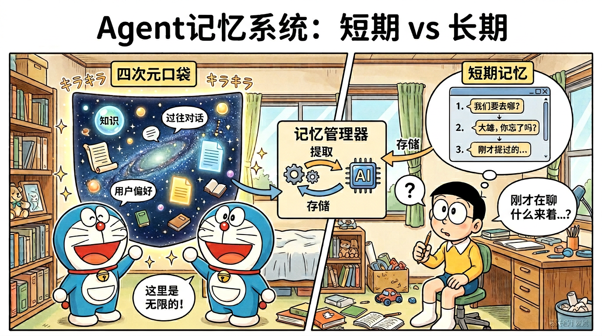

# 05｜记忆系统（Memory）



面向初学者的系统梳理：从「为什么需要记忆」到生产落地与高级框架。每个小节尽量包含：**概念解释**、**原理详解**、**面试问答（Q/A）**、**追问应对**、**Python 代码示例**（示意为主，可按项目依赖调整）。

### 本篇目录

1. [记忆系统概述](#1-记忆系统概述)  
2. [短期记忆](#2-短期记忆-short-term--working-memory)  
3. [长期记忆](#3-长期记忆-long-term-memory)  
4. [会话摘要与压缩](#4-会话摘要与压缩)  
5. [情景记忆与语义记忆](#5-情景记忆与语义记忆)  
6. [记忆检索策略](#6-记忆检索策略)  
7. [高级记忆框架](#7-高级记忆框架)  
8. [记忆在生产中的挑战](#8-记忆在生产中的挑战)  
附：[更多面试题 Q16～Q20](#附更多高频面试题q16q20与简短标准答)

---

## 1. 记忆系统概述

### 1.1 概念解释

**记忆（Memory）**在 Agent 语境里，指系统为完成多轮对话、长期任务与个性化服务而**存储、组织、检索、更新信息**的一整套机制。没有记忆，Agent 只能做「无状态函数调用」：每次请求都像第一次见面，无法延续偏好、历史决策与上下文因果。

### 1.2 原理详解

- **状态与上下文的区别**：单次请求的 prompt 是**瞬时输入**；记忆是**跨请求持久或半持久的状态**，可被策略性地注入 prompt、工具参数或规划模块。
- **与 RAG 的关系**：长期记忆常与向量检索结合，但记忆还强调**时间线、重要性、用户维度、写入策略**（不只是「找文档」）。
- **设计目标**：在 **Token 预算、延迟、成本、隐私** 约束下，最大化「对当前任务有用」的信息覆盖率。

### 1.3 人类记忆类比（感觉 / 短期 / 长期）

| 心理学概念 | 大致特征 | Agent 中的常见对应 |
|-----------|----------|---------------------|
| **感觉记忆** | 极短、容量大、未加工 | 原始多模态输入缓存、流式 ASR 缓冲、截图/音频临时块 |
| **短期记忆 / 工作记忆** | 容量小、可主动操作 | 对话上下文、Working Memory、ReAct 轨迹中的「当前 scratchpad」 |
| **长期记忆** | 持久、需巩固 | 向量库、文档库、用户画像表、知识图谱、会话摘要归档 |

类比的价值：**帮助划分模块职责**——哪些必须快、哪些可以慢；哪些必须忘、哪些必须存。

### 1.4 Agent 记忆的分类体系（实用版）

1. **按时间尺度**：短期（会话内）vs 长期（跨会话）。
2. **按内容类型**：程序性（怎么做）、陈述性（事实）、情景性（何时何地何人）、语义性（抽象知识）——后两者见第 5 节。
3. **按存储介质**：进程内存、Redis、关系库、向量库、图数据库、对象存储。
4. **按可控性**：显式记忆（用户确认保存）vs 隐式记忆（系统自动提炼）。

### 1.5 面试问题 Q1～Q2

**Q1：为什么 Agent 需要记忆？没有行不行？**

**A：**需要。原因包括：（1）**多轮一致性**——避免重复追问、前后矛盾；（2）**长任务**——工具调用链、子目标状态需要延续；（3）**个性化**——偏好、禁忌、领域术语；（4）**成本**——不必每次把全量背景塞进 prompt，可通过摘要与检索按需加载。  
「没有记忆」在简单 FAQ 或单次工具调用场景可能够用，但在助理、客服、编程 Agent、游戏 NPC 等场景会明显不可用。

**追问应对：**若面试官问「用 RAG 算不算记忆？」——答：算**长期记忆的一种实现路径**，但完整记忆系统通常还包括写入策略、衰减、用户隔离、摘要与时间线，而不仅是检索切片。

---

**Q2：用人类记忆模型设计 Agent 记忆有什么好处？**

**A：**好处是**模块化与可解释**：短期对应上下文窗口与 scratchpad，长期对应向量库/图谱；感觉记忆对应流缓冲。你可以针对不同模块设不同 SLA（延迟、持久化）。风险是**类比不能硬套**——计算机没有神经可塑性，需要工程上显式实现「巩固、遗忘、冲突解决」。

**追问应对：**若问「程序性记忆怎么落地？」——答：常放在 **工具说明书、工作流模板、可执行策略（policy）** 或 **微调/少样本示例** 中，不一定进向量库。

---

## 2. 短期记忆（Short-term / Working Memory）

### 2.1 概念解释

**短期记忆**一般指**当前会话或当前任务周期内**可被模型直接「看到」的信息载体，通常受 **Token 上限**与**延迟**约束。

### 2.2 原理详解

#### 2.2.1 会话上下文（Conversation Buffer）

- **做法**：将多轮 `user` / `assistant`（及可选 `system`）消息按时间顺序拼接进模型输入。
- **特点**：信息保真度高；对话越长，**越贵、越慢、越易注意力分散**。

#### 2.2.2 滑动窗口记忆（Window Buffer）

- **做法**：只保留最近 \(k\) 轮或最近 \(n\) 个 Token。
- **特点**：成本可控；可能丢失早期关键约束（例如「不要用 Python」写在很前面）。

#### 2.2.3 Token 计数管理

- **为什么重要**：模型有 **context window**；计费常按 Token；过长上下文还会带来**中间遗忘**现象（模型对长上下文中间部分关注变弱）。
- **常见策略**：  
  - 精确计数：用分词器（如 `tiktoken`）估算；  
  - 预算分配：system 固定 + tools schema + memory + 本轮用户输入；  
  - 超限处理：截断、摘要、检索增强。

### 2.3 面试问题 Q3～Q4

**Q3：Conversation Buffer 和 Window Buffer 的区别与取舍？**

**A：**Buffer 强调**完整保留**（直到触顶）；Window 强调**只保留尾部**。取舍：若任务强依赖「很久以前的一条约束」，纯 Window 会丢信息，需要配合摘要或长期记忆检索。

**追问应对：**可以补充 **「关键句提取」+ Window**：先抽取硬约束进 profile，再对对话做窗口截断。

---

**Q4：如何做 Token 预算分配才不容易翻车？**

**A：**建议顺序：**system 指令 > 安全/策略 > 工具定义（若必须）> 高优先级记忆（用户偏好/任务状态）> 近期对话 > 其他**。并预留 **10%～20%** 给模型输出与格式冗余。对长工具返回要**压缩、引用 ID、存外部**而不是全文塞入。

**追问应对：**若问「工具 schema 特别长怎么办？」——答：**工具分层**（核心工具常驻 + 动态加载）、**摘要版 schema**、或 **工具路由** 先选子集再展开。

---

### 2.4 代码示例（Python）

下面示例展示：**会话缓冲 + 滑动窗口 + tiktoken 计数**（示意）。

```python
from dataclasses import dataclass
from typing import List, Dict, Literal
import tiktoken

Role = Literal["system", "user", "assistant"]

@dataclass
class ChatMessage:
    role: Role
    content: str

class WindowedConversationMemory:
    """滑动窗口 + Token 预算（示意）。"""

    def __init__(self, model: str = "gpt-4o", max_tokens: int = 3000, window_messages: int = 20):
        self.max_tokens = max_tokens
        self.window_messages = window_messages
        # 不同模型请换对应 encoding
        self.enc = tiktoken.encoding_for_model(model)
        self.messages: List[ChatMessage] = []

    def add(self, role: Role, content: str) -> None:
        self.messages.append(ChatMessage(role=role, content=content))
        # 先限制消息条数
        if len(self.messages) > self.window_messages:
            self.messages = self.messages[-self.window_messages :]
        # 再按 token 预算从尾部往前保留
        self._shrink_to_budget()

    def _count_tokens(self, messages: List[ChatMessage]) -> int:
        text = "\n".join(f"{m.role}: {m.content}" for m in messages)
        return len(self.enc.encode(text))

    def _shrink_to_budget(self) -> None:
        while self.messages and self._count_tokens(self.messages) > self.max_tokens:
            # 简单策略：丢弃最早一条（生产可改为优先丢 tool 大 payload）
            self.messages.pop(0)

    def as_openai_messages(self) -> List[Dict[str, str]]:
        return [{"role": m.role, "content": m.content} for m in self.messages]


# 使用示例
mem = WindowedConversationMemory(max_tokens=256, window_messages=50)
mem.add("system", "你是助手，回答尽量简洁。")
mem.add("user", "我叫阿明。")
mem.add("assistant", "好的，阿明。")
print(mem.as_openai_messages())
print("tokens ~=", mem._count_tokens(mem.messages))
```

---

## 3. 长期记忆（Long-term Memory）

### 3.1 概念解释

**长期记忆**用于跨会话、跨任务保留信息，典型实现是「**向量数据库 + 元数据**」：把记忆文本（或结构化记录）向量化，通过相似度检索召回。

### 3.2 原理详解

#### 3.2.1 基于向量数据库的长期记忆

- **写入**：记忆文本 → embedding 模型 → 向量；同时存 `user_id`、`timestamp`、`type`、`source` 等元数据。  
- **检索**：查询文本 embedding → Top-K 相似向量 → 过滤（用户隔离、时间范围、类型）→ 注入 prompt。

#### 3.2.2 存储、检索、更新、删除（CRUD）

- **存**：插入向量与元数据；大批量用批量 embedding。  
- **检**：相似度 + 过滤 + 重排（可选 cross-encoder）。  
- **更**：常见是「删旧插新」或「版本字段」；纯向量库若无主键管理，需要业务层 ID。  
- **删**：按用户注销、过期策略、显式「忘记」指令执行硬删除或 tombstone。

#### 3.2.3 记忆重要性评分

- **目的**：检索与遗忘时优先保留高价值信息。  
- **来源**：  
  - 规则：关键词（密码、地址）加权；  
  - 模型打分：让 LLM 输出 1～10 重要性（需 JSON 约束与校验）；  
  - 用户反馈：点赞/纠正。

#### 3.2.4 记忆衰减机制

- **直觉**：越久未使用、越低相关的记忆应降权或归档。  
- **常见做法**：  
  - **时间衰减**：得分乘 \(\exp(-\lambda \Delta t)\) 或幂函数；  
  - **访问强化**：被召回/点击则提升「最近访问时间」权重；  
  - **睡眠巩固**：离线任务把零散记忆合并成更高层摘要（类似人脑巩固）。

### 3.3 面试问题 Q5～Q7

**Q5：长期记忆为什么常用向量数据库？有什么局限？**

**A：**常用是因为语义检索能处理「换说法」的匹配。局限包括：**相似≠正确**（会召回到表面相近的噪声）、**难精确匹配**（账号、订单号更适合关键字/关系库）、**更新一致性**需业务层保障。

**追问应对：**补充 **混合检索（BM25 + 向量）** 与 **重排**。

---

**Q6：记忆的更新怎么做才不容易脏数据？**

**A：**推荐：**主键化**（memory_id）、**显式版本**（`updated_at`）、**冲突策略**（最新覆盖、用户确认合并、保留多版本供检索）。自动摘要写入长期记忆前最好有**置信度与来源引用**。

**追问应对：**若问「向量更新了但业务库没更新怎么办？」——答：用 **事务或最终一致性**：先写业务主库拿 `memory_id`，再异步写向量；失败重试 + **对账任务**比对两边条目数与哈希。

---

**Q7：衰减会不会把重要但很久不用的信息删掉？**

**A：**会，这是权衡。缓解：**分离「冷存储」与「热索引」**；对标记为高重要/用户固定的记忆降低衰减速度；支持用户「钉住」偏好。

**追问应对：**若问「医疗法律等强合规场景呢？」——答：衰减更偏 **归档** 而非物理删除，并保留 **审计日志** 与 **用户导出/删除** 能力。

---

### 3.4 代码示例（Python）

下面用 **内存版伪向量库**演示流程；生产可替换为 FAISS、Milvus、Qdrant、pgvector 等。

```python
from dataclasses import dataclass
from typing import List, Optional, Dict, Any
import math
import time
import hashlib

def fake_embed(text: str, dim: int = 8) -> List[float]:
    """仅用于演示的确定性伪向量；真实项目请调用 embedding API。"""
    h = hashlib.sha256(text.encode("utf-8")).digest()
    vec = [((h[i % len(h)] + i) % 97) / 97.0 for i in range(dim)]
    norm = math.sqrt(sum(x * x for x in vec)) or 1.0
    return [x / norm for x in vec]

def cosine_sim(a: List[float], b: List[float]) -> float:
    return sum(x * y for x, y in zip(a, b))

@dataclass
class MemoryItem:
    id: str
    user_id: str
    text: str
    vector: List[float]
    importance: float  # 0~1
    created_at: float
    last_accessed: float

class SimpleLongTermMemoryStore:
    def __init__(self, dim: int = 8):
        self.dim = dim
        self.items: Dict[str, MemoryItem] = {}

    def add(self, user_id: str, text: str, importance: float = 0.5) -> str:
        mem_id = hashlib.md5(f"{user_id}:{text}:{time.time()}".encode("utf-8")).hexdigest()[:12]
        now = time.time()
        vec = fake_embed(text, self.dim)
        self.items[mem_id] = MemoryItem(
            id=mem_id,
            user_id=user_id,
            text=text,
            vector=vec,
            importance=max(0.0, min(1.0, importance)),
            created_at=now,
            last_accessed=now,
        )
        return mem_id

    def delete(self, mem_id: str) -> None:
        self.items.pop(mem_id, None)

    def update_text(self, mem_id: str, new_text: str) -> None:
        if mem_id not in self.items:
            return
        it = self.items[mem_id]
        self.items[mem_id] = MemoryItem(
            id=it.id,
            user_id=it.user_id,
            text=new_text,
            vector=fake_embed(new_text, self.dim),
            importance=it.importance,
            created_at=it.created_at,
            last_accessed=time.time(),
        )

    def search(
        self,
        user_id: str,
        query: str,
        top_k: int = 5,
        decay_lambda: float = 2e-7,  # 时间衰减系数（示意）
    ) -> List[tuple[float, MemoryItem]]:
        q = fake_embed(query, self.dim)
        now = time.time()
        scored: List[tuple[float, MemoryItem]] = []
        for it in self.items.values():
            if it.user_id != user_id:
                continue
            rel = cosine_sim(q, it.vector)
            age_sec = max(0.0, now - it.last_accessed)
            recency = math.exp(-decay_lambda * age_sec)  # decay_lambda 越大，遗忘越快
            # 综合得分：相关性 + 重要性 + 近期性（权重可调）
            score = 0.6 * rel + 0.2 * it.importance + 0.2 * recency
            scored.append((score, it))
        scored.sort(key=lambda x: x[0], reverse=True)
        return scored[:top_k]

store = SimpleLongTermMemoryStore()
mid = store.add("u1", "用户偏好：沟通风格简洁。", importance=0.9)
store.update_text(mid, "用户偏好：沟通风格简洁；禁用表情。")
hits = store.search("u1", "他喜欢怎么说话？")
for s, it in hits:
    print(round(s, 4), it.text)
```

---

## 4. 会话摘要与压缩

### 4.1 概念解释

**摘要与压缩**是把长对话变为更短表示，以在 Token 预算内保留尽可能多的「任务有效信息」。

### 4.2 原理详解

#### 4.2.1 为什么需要摘要压缩

- 对话变长后：**成本高、延迟高、模型更容易漏看中间约束**。  
- 摘要把信息搬到更短载体，配合长期记忆检索，实现「**短上下文 + 广记忆**」。

#### 4.2.2 自动摘要（LLM Summary）

- **做法**：周期性或在写入长期记忆前，调用 LLM 生成摘要。  
- **要点**：给明确模板（保留约束/未决问题/用户目标）、要求**可追溯**（列出引用消息 id）。

#### 4.2.3 增量摘要 vs 全量摘要

| 类型 | 做法 | 优点 | 缺点 |
|------|------|------|------|
| **增量** | 新消息来了，把「旧摘要 + 新片段」再摘要 | 省算力与成本 | 可能误差累积、早期细节被吞 |
| **全量** | 定期对完整对话重摘要 | 更一致 | 成本高、对话极长时仍可能触顶 |

工程上常见：**增量在线 + 定期全量校准**。

#### 4.2.4 Token 成本 vs 信息保留

- **权衡轴**：摘要越短越省钱，但可能丢约束；越长越保真，但接近 Window 上限。  
- **策略**：分层——硬约束进结构化槽位；软偏好进摘要；细节进向量库按需检索。

### 4.3 面试问题 Q8～Q9

**Q8：只用向量检索、不做摘要可以吗？**

**A：**可以，但你会失去**低成本的全局叙事**（例如任务阶段、未决事项）。摘要擅长提供「主线」，向量擅长提供「细节证据」。最佳实践常是**摘要 + 检索并存**。

**追问应对：**若数据极结构化（工单系统），可用**状态机字段**替代部分摘要。

---

**Q9：增量摘要误差累积怎么缓解？**

**A：**（1）定期全量重摘要；（2）摘要中保留**关键事实清单**（姓名、日期、硬约束）；（3）对摘要做**一致性检查**（另一个小模型挑错）；（4）让用户可编辑「长期事实」。

---

### 4.4 LangChain `ConversationSummaryMemory` 示例（Python）

> 注意：LangChain API 随版本变化较大，以下为 **v0.2+ 常见写法示意**；面试中强调「理解机制」比背 API 更重要。

```python
# pip install langchain langchain-openai
from langchain.memory import ConversationSummaryMemory
from langchain_openai import ChatOpenAI
import os

llm = ChatOpenAI(model="gpt-4o-mini", temperature=0, api_key=os.environ.get("OPENAI_API_KEY"))

memory = ConversationSummaryMemory(
    llm=llm,
    memory_key="history",
    return_messages=False,  # 返回字符串摘要；True 则消息列表
)

# 模拟多轮写入
memory.save_context({"input": "我在做电商客服项目。"}, {"output": "好的，需要我帮你梳理架构吗？"})
memory.save_context({"input": "我们使用向量库存 FAQ。"}, {"output": "明白，可再加一层重排。"})

print(memory.buffer)  # 当前累积的摘要文本（不同版本字段名可能为 moving_summary_buffer 等）
```

若你使用的版本将 `ConversationSummaryMemory` 标为 deprecated，面试话术可以是：**「我会改用 MessagesPlaceholder + 显式 summarize 链，或迁移到 LangGraph 状态里的 summary 字段。」**

---

## 5. 情景记忆与语义记忆

### 5.1 概念解释

- **情景记忆（Episodic）**：关于**具体事件**——时间、地点、参与者、发生了什么。例如「昨天下午用户让我把报表改成 PDF」。  
- **语义记忆（Semantic）**：**一般性知识**——概念、事实、规则。例如「PDF 是便携式文档格式」「公司退货政策是 7 天」。

### 5.2 原理详解

- 在 Agent 中：  
  - **情景**常存为「带时间戳的对话片段、任务轨迹、工具调用日志」。  
  - **语义**常存为「知识库条目、政策文档、FAQ、图谱三元组」。  
- **转化关系**：多条情景可抽象成语义（归纳）；语义在具体任务中落地为情景（实例化）。

### 5.3 在 Agent 中的实现方式

- **数据模型分层**：`EpisodicRecord(ts, actors, text, embedding)` vs `SemanticFact(key, value, source, confidence)`。  
- **检索策略**：情景检索偏 **时间邻近 + 事件相似**；语义检索偏 **概念相似 + 权威来源**。  
- **合并**：回答用户时先定位情景（我做过什么），再引用语义（规则是什么）。

### 5.4 面试问题 Q10

**Q10：情景记忆和语义记忆为什么要区分存储？**

**A：**因为**更新频率、隐私级别、检索特征**不同：情景更个人化、更时间敏感；语义更共享、更稳定。区分后可做不同保留策略（情景更易过期）、不同权限（情景多用户隔离更严格），并减少把「一次性事件」误当「长期规则」。

**追问应对：**补充 **从情景归纳成语义** 的离线 job（反思模块）。

---

### 5.5 代码示例（Python）：情景与语义的分表模型

```python
from dataclasses import dataclass
from typing import List, Optional

@dataclass
class EpisodicRecord:
    """情景：具体发生过什么（个人化、带时间）。"""
    id: str
    user_id: str
    ts: float
    summary: str          # 例如「2026-04-01 用户要求关闭自动续费」
    embedding_id: str     # 指向向量库中的向量

@dataclass
class SemanticFact:
    """语义：可共享或较稳定的事实/规则。"""
    key: str              # 例如 "billing.autorenew.policy"
    value: str
    source: str           # 文档版本、政策编号
    confidence: float

def route_query(intent: str) -> str:
    """示意：不同意图走不同记忆库（真实系统可用分类器）。"""
    if "上次" in intent or "刚才" in intent:
        return "episodic"
    return "semantic"
```

---

## 6. 记忆检索策略

### 6.1 概念解释

**检索策略**决定「下一轮生成之前，从记忆池里取什么」。单一策略往往不够，需要混合。

### 6.2 原理详解

#### 6.2.1 基于时间的检索

- **最近对话**优先：强时效任务（排障、联调）更有效。  
- **实现**：按 `created_at` 排序取最近 K 条；或时间衰减加权。

#### 6.2.2 基于相关性的检索

- **语义相似**：embedding 近似的记忆优先。  
- **适合**：开放域问答、用户换说法。

#### 6.2.3 基于重要性的检索

- **关键信息**优先：例如项目目标、硬约束、用户级别偏好。  
- **适合**：长会话中早期出现但「仍然必须遵守」的内容。

#### 6.2.4 混合检索策略

- **典型 pipeline**：三路召回（时间 / 向量 / 关键词）→ 去重 → 重排 → Token 截断注入。  
- **关键**：定义统一打分函数或可学习重排模型。

#### 6.2.5 Generative Agents 论文中的记忆检索思想（公式）

斯坦福 **Generative Agents** 提出：自然语言记忆在检索时应综合 **相关性（relevance）**、**近期性（recency）**、**重要性（importance）**。常见实现会对每项做归一化后加权：

\[
\text{score}(m \mid q) =
w_{\text{rel}}\cdot \widehat{\text{rel}}(m, q)
+ w_{\text{rec}}\cdot \widehat{\text{recency}}(m)
+ w_{\text{imp}}\cdot \widehat{\text{importance}}(m)
\]

- \(\widehat{\text{rel}}\)：查询 \(q\) 与记忆 \(m\) 的向量相似度（或其他相关性）映射到 \([0,1]\)。  
- \(\widehat{\text{recency}}\)：随距离上次发生/访问时间增大而下降（常用指数衰减）。  
- \(\widehat{\text{importance}}\)：由模型或规则给出的重要性归一化。  
- \(w_{\*}\)：权重需调参；也可用乘法形式强调「必须同时满足」。

> 面试表述建议：强调**多因子融合**与**归一化**，并说明线上要 AB 测试权重。

### 6.3 面试问题 Q11～Q12

**Q11：混合检索怎么去重与限长？**

**A：**去重：同一事实不同表述可用 **语义去重**（相似度阈值）或 **canonical key**（实体对齐）。限长：按最终 `rerank_score` 排序后做 **Token 装箱**；或分层注入「摘要优先、细节按需」。

**追问应对：**若问「去重会不会误删相似但不同约束？」——答：用 **阈值 + 冲突检测**（矛盾触发人工或二次 LLM 仲裁），而非纯相似度合并。

---

**Q12：只做强相关性检索会有什么问题？**

**A：**会漏掉**仍然有效但表述不相似**的硬约束；也会过度偏向「像」但错误的片段。需要 **时间**与**重要性**补足。

**追问应对：**若问「三路召回怎么融合？」——答：**RRF（倒数排名融合）**、或统一打分后 **线性加权 / Learning to Rank**，线上 AB 调参。

---

### 6.4 代码示例（Python）：三因子打分骨架

```python
from dataclasses import dataclass
import math
import time
from typing import List

@dataclass
class Mem:
    id: str
    text: str
    importance: float      # 0~1
    last_access_ts: float  # 上次被访问/发生时间

def norm_minmax(values: List[float]) -> List[float]:
    if not values:
        return []
    lo, hi = min(values), max(values)
    if hi - lo < 1e-9:
        return [1.0 for _ in values]
    return [(v - lo) / (hi - lo) for v in values]

def generative_agent_style_scores(
    rel_scores: List[float],
    memories: List[Mem],
    w_rel: float = 0.5,
    w_rec: float = 0.3,
    w_imp: float = 0.2,
    decay_per_hour: float = 0.2,
) -> List[float]:
    """演示：相关性 + 指数近期性 + 重要性 的加权融合。"""
    now = time.time()
    recency_raw = []
    for m in memories:
        hours = max(0.0, (now - m.last_access_ts) / 3600.0)
        recency_raw.append(math.exp(-decay_per_hour * hours))

    rel_n = norm_minmax(rel_scores)
    rec_n = norm_minmax(recency_raw)
    imp_n = [m.importance for m in memories]  # 已 0~1

    out = []
    for i in range(len(memories)):
        out.append(w_rel * rel_n[i] + w_rec * rec_n[i] + w_imp * imp_n[i])
    return out
```

---

## 7. 高级记忆框架

### 7.1 概念解释

当对话与工具轨迹变复杂后，会出现「上下文装不下、长期记忆难组织」的问题，业界提出更接近操作系统的记忆架构。

### 7.2 原理详解

#### 7.2.1 MemGPT / MemOS

- **MemGPT 核心思想**：把 LLM 上下文当作「**有限 RAM**」，把外部存储当作「**磁盘**」，通过 **分页/换入换出** 与 **事件驱动** 控制信息进出上下文。典型流程包括：当上下文将满时，由**控制逻辑**（可外挂函数）决定把哪些内容**外溢**到外部归档，并在需要时再**加载**回上下文；这与「每次用户提问都做一次相似度检索」的被动 RAG 不同，更强调**对记忆载体的主动管理**。  
- **你要能讲清的点**：外溢策略（FIFO、重要性、摘要）、**主上下文 vs 外部上下文** 的边界、以及为何能缓解长对话的 **lost-in-the-middle** 与成本问题。  
- **MemOS**：多指「记忆操作系统」式架构——把记忆拆成 **多层**（例如：瞬时上下文、会话工作区、用户级长期存储、共享知识），并由调度器决定读写路径与配额；与 MemGPT 同属「**分层 + 调度**」一脉，名称随论文/开源项目演进，面试重点在思想而非单一产品版本。

#### 7.2.2 Mem0 框架

- **定位**：面向应用的 **记忆层（memory layer）**，把「从对话中抽取可复用记忆 → 更新 → 检索」做成可集成组件，常与 **向量检索、图结构、用户画像** 组合使用。  
- **价值**：把「写记忆」从纯 prompt 技巧下沉为 **可复用模块**，便于在多应用间复用同一套写入与冲突处理策略。  
- **面试表述**：Mem0 偏 **工程化记忆中间件**；与 MemGPT 的「OS 分页」可互补——前者管 **抽取与存储管线**，后者管 **上下文与外存之间的搬运策略**。

#### 7.2.3 记忆的反思与整合

- **反思（Reflection）**：周期性让模型回顾轨迹，生成更高层见解（「我哪里做错了」「用户真正想要什么」）。  
- **整合（Consolidation）**：把多条低层记录合并成稳定条目，减少冗余与冲突。

#### 7.2.4 记忆图谱

- **做法**：实体—关系—实体（或超边）存储；检索用图遍历 + 向量。  
- **收益**：可解释、可推理「多跳关系」；成本是构建与对齐更难。

### 7.3 面试问题 Q13～Q14

**Q13：MemGPT 和简单 RAG 的本质区别是什么？**

**A：**RAG 多是**被动检索**；MemGPT 强调**主动内存管理**——模型或控制器决定何时把外部记忆换入上下文、何时写出、如何分页，更像 **OS 管理 RAM**。

**追问应对：**可以补充 **控制流可由函数调用/工具** 实现。

---

**Q14：记忆图谱比向量库强在哪里，弱在哪里？**

**A：**强在 **多跳推理与结构化关系**；弱在 **构建成本高**、实体对齐难，且对非结构化闲聊未必划算。

---

### 7.4 代码示例（Python）：极简「反思摘要」

```python
def reflect(transcript: str, llm_complete) -> str:
    prompt = (
        "你是反思模块。请基于以下轨迹输出3条高层见解，"
        "用中文条目列出：\n"
        f"{transcript}\n"
    )
    return llm_complete(prompt)

# llm_complete 为调用大模型的函数占位
```

---

## 8. 记忆在生产中的挑战

### 8.1 概念解释

从 Demo 到生产，记忆系统要面对 **多租户、持久化、并发一致性、隐私合规、性能与成本**。

### 8.2 原理详解

#### 8.2.1 多用户记忆隔离

- **硬性要求**：`user_id` / `tenant_id` 过滤必须贯穿写入与检索；向量库元数据过滤要 **默认开启**。  
- **常见事故**：检索忘记加租户条件导致 **串数据**。

#### 8.2.2 持久化存储

- **选择**：向量库（Milvus/Qdrant）、pgvector、Elasticsearch 混合；会话摘要与元数据可放 Postgres。  
- **要点**：备份、迁移、索引重建、embedding 模型升级后的 **重嵌入策略**。

#### 8.2.3 记忆的一致性

- **问题**：摘要与向量库条目冲突、重复记忆、旧偏好未删除。  
- **策略**：主键、版本号、合并策略、定期对账任务（reconciliation）。

#### 8.2.4 隐私与安全

- **最小化**：只存必要字段；敏感信息加密或 token 化；支持删除（被遗忘权）。  
- **提示注入**：检索到的记忆可能含恶意内容，需要 **清洗与信任分级**。

#### 8.2.5 性能优化

- **embedding 缓存**、批量写入、预过滤缩小候选集、**重排模型裁剪**、冷热分层、异步摘要。

#### 8.2.6 生产落地检查表（面试可当作「经验题」素材）

| 维度 | 典型问题 | 缓解手段 |
|------|----------|----------|
| 隔离 | 检索串租户 | 元数据强制过滤 + 单测覆盖 |
| 持久化 | 索引损坏、迁移失败 | 备份、双写过渡期、回放重建 |
| 一致性 | 摘要与向量矛盾 | 版本号、主库为准、对账任务 |
| 隐私 | PII 进向量库 | 脱敏、加密、分级存储、可删除 |
| 性能 | 召回慢 | 预过滤、缓存 embedding、减小候选集 |
| 安全 | 恶意记忆污染 | 信任分级、人工审核通道、红队 |

### 8.3 面试问题 Q15

**Q15：生产环境记忆系统最容易出的事故是什么？怎么防？**

**A：**最常见是 **租户隔离失败** 与 **把敏感数据写入长期记忆未加密**。防护：强制租户过滤的集成测试、检索审计日志、敏感字段检测、密钥与 PII 脱敏、最小权限访问向量库。

**追问应对：**补充 **红队测试**（诱导模型保存恶意指令）。

---

## 附：更多高频面试题（Q16～Q20）与简短标准答

**Q16：记忆和 Tool Use 的边界是什么？**

**A：**工具解决「当下获取外部世界状态」；记忆解决「跨时间保留与回忆」。边界：实时动态数据应工具查；稳定偏好与历史事件应记忆存。

**追问应对：**若问「库存算哪边？」——答：**实时库存走工具**；「用户常买类目」可走记忆或画像。

---

**Q17：如何评测记忆系统好坏？**

**A：**离线：召回率/精确率（给定标注 relevant memories）、摘要一致性、冲突率。在线：任务成功率、用户纠正次数、成本与延迟。

**追问应对：**补充 **人工抽检** 与 **bad case 归因**（检索错 vs 摘要错 vs 写入错）。

---

**Q18：未来记忆系统趋势你怎么看待？**

**A：**更强调 **分层 + 可学习检索 + 用户可控**；合规与可删除性成为默认需求；与 **世界模型/仿真** 结合用于更强规划（开放题，言之成理即可）。

---

**Q19：Embedding 模型升级后旧向量怎么办？**

**A：**旧向量与新型不在同一空间，**不可混比**。做法：**双写期**（新旧模型并行写）、**离线全量重嵌入**、检索时标明 `embedding_model_version`，查询与库版本一致。

---

**Q20：多 Agent 共享记忆要注意什么？**

**A：**区分 **共享语义知识**（可读多 Agent）与 **私有工作记忆**（单 Agent）；写权限要审计；避免一个 Agent 写入污染全局记忆——可用 **命名空间、审批流、置信度门槛**。

---

## 小结

- **短期记忆**服务「当下推理」，要处理 **窗口与 Token**；**长期记忆**服务「跨会话个性化与知识」，常配 **向量检索 + 元数据**。  
- **摘要**解决成本与注意力问题，但要防 **误差累积**；**情景/语义**划分有助于权限与更新策略。  
- **检索**应混合 **时间、相关性、重要性**；Generative Agents 的多因子思想是面试高频点。  
- **MemGPT/Mem0/图谱**代表不同抽象层级；落地关键是 **隔离、持久化、一致性、隐私与性能**。

---

**说明：**文中 Python 多为可运行骨架；embedding、LangChain 版本、数据库接口请按你司栈替换。面试时优先讲清 **机制、权衡、事故面**，再补充框架名称与公式细节。全篇共 **20 道**带标准答的面试题（Q1～Q20），可按模块分段复习。
