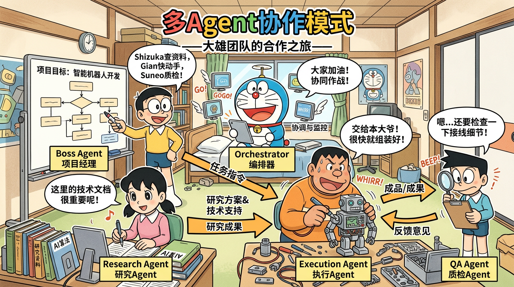

# 06｜多智能体系统（Multi-Agent Systems）



面向初学者的系统梳理：从「为什么不用一个超大 Agent」到协作模式、通信、任务分配、冲突解决、状态同步、主流框架与生产落地。每个小节尽量包含：**概念解释**、**原理详解**、**面试问答（Q/A）**、**追问应对**、**Python 代码示例**（示意为主，可按项目依赖调整）。

### 本篇目录

1. [为什么需要多智能体](#1-为什么需要多智能体)
2. [三大协作模式](#2-三大协作模式)
3. [通信机制](#3-通信机制)
4. [任务分配策略](#4-任务分配策略)
5. [冲突解决](#5-冲突解决)
6. [状态管理与同步](#6-状态管理与同步)
7. [主流多 Agent 框架](#7-主流多-agent-框架)
8. [多 Agent 在企业中的应用](#8-多-agent-在企业中的应用)
9. [生产挑战](#9-生产挑战)
附：[更多面试题 Q16～Q20](#附更多高频面试题q16q20与简短标准答)

---

## 1. 为什么需要多智能体

### 1.1 概念解释

**多智能体系统（Multi-Agent System, MAS）**指多个相对独立的 **Agent**（通常每个绑定不同角色、工具或策略）在某种 **协作协议** 下共同完成复杂任务。与「一个通用大模型 + 长提示词」相比，多 Agent 强调 **分工、通信、状态与治理**。

### 1.2 原理详解

#### 1.2.1 单 Agent 的常见瓶颈

| 现象 | 通俗说法 | 技术含义 |
|------|----------|----------|
| **注意力漂移** | 提示词越长，模型越「抓不住重点」 | 长上下文下，关键约束与中间推理步骤被稀释；模型对中间段落的有效利用弱于首尾（与架构与训练有关，常被称为 **lost in the middle** 类问题） |
| **推理链断裂** | 一步想太多，后面忘了前面 | 复杂任务需要多步规划与回溯；单轨迹里若缺少外部结构化记忆，易出现自相矛盾或跳步 |
| **能力局限** | 「一个全能选手」往往样样稀松 | 单一 system prompt 难以同时覆盖：严谨规划、创意发散、代码执行、合规审查；工具权限也难以「全开」而不失控 |

#### 1.2.2 多 Agent 的优势

- **专业化分工（Specialization）**：每个子 Agent 有窄而深的职责（如「只写测试」「只做威胁建模」），提示词与工具集可更小、更稳。
- **并行处理（Parallelism）**：无强依赖的子任务可并行调用模型或工具，缩短墙钟时间（需注意成本与速率限制）。
- **容错与隔离（Fault tolerance）**：某一子 Agent 失败可重试、替换实现或降级策略，避免整系统一次失败全盘重来。

### 1.3 面试问题 Q1～Q3

**Q1：单 Agent 和多 Agent 的本质区别是什么？什么时候该上多 Agent？**

**A：**本质区别不在「调几次模型」，而在 **是否显式建模角色、通信与治理**。单 Agent 适合：任务边界清晰、工具少、强实时、成本极度敏感的场景。多 Agent 适合：**任务可分解**、**需要不同专业视角**、**需要并行**、**需要权限隔离**（例如代码执行与对外发布分离）、**需要可观测的分阶段产出** 的场景。

**追问应对：**若问「多 Agent 会不会更贵？」——答：通常 **Token 与调用次数上升**，但若通过 **小模型子任务 + 大模型仲裁**、**并行缩短时间**、**减少无效重试**，总成本未必更高，需要按业务度量。

---

**Q2：什么是「注意力漂移」？多 Agent 如何缓解？**

**A：**注意力漂移指模型在长上下文或多目标提示下，对关键约束的关注度下降，导致输出偏离要求。多 Agent 缓解方式包括：**拆分子目标**使每个子上下文更短；**专职角色**减少单提示中的目标数量；**中间结果结构化**（JSON/状态机）减少自然语言堆砌。

**追问应对：**若问「不用多 Agent 怎么缓解？」——答：**摘要、检索注入关键句、约束前置、链式调用 with 校验器** 等。

---

**Q3：多 Agent 的「容错」具体怎么体现？**

**A：**体现为 **失败隔离 + 可替换性**：例如审查 Agent 发现实现 Agent 的代码不合规，可打回重写而不污染主对话；执行 Agent 沙箱崩溃可只重启该步骤。工程上常配合 **重试、指数退避、断路器、降级模板**。

**追问应对：**若问「会不会互相甩锅？」——答：会，所以需要 **明确终止条件、主席/仲裁机制、可观测日志**（见第 5、9 节）。

---

### 1.4 代码示例（Python）

下面用极简类展示：**单 Agent 长链** vs **多 Agent 分步**，便于理解「上下文切分」的价值（非真实框架，仅教学）。

```python
from dataclasses import dataclass
from typing import List, Callable, Dict, Any

@dataclass
class SimpleAgent:
    name: str
    system_hint: str
    # 真实场景此处应是 LLM 调用；这里用占位函数模拟
    model: Callable[[str, str], str]

    def run(self, user_input: str, scratchpad: str = "") -> str:
        prompt = f"{self.system_hint}\n\n[上下文]\n{scratchpad}\n\n[用户]\n{user_input}"
        return self.model(self.name, prompt)


def demo_single_long_chain(model: Callable[[str, str], str]) -> str:
    """单 Agent：把所有子任务说明塞进一次调用（易长、易混）。"""
    mega_prompt = "你是全能助手。依次完成：需求分析、接口设计、写代码、写测试、审查。"
    return model("single", mega_prompt)


def demo_multi_agents(model: Callable[[str, str], str]) -> Dict[str, str]:
    """多 Agent：每步短上下文，下一步只带必要摘要。"""
    roles = [
        ("analyst", "你只输出需求要点列表。"),
        ("architect", "你只输出模块与接口草案。"),
        ("coder", "你只输出代码。"),
    ]
    outputs: Dict[str, str] = {}
    scratch = ""
    for name, hint in roles:
        agent = SimpleAgent(name, hint, model)
        out = agent.run("根据上一轮摘要继续。", scratchpad=scratch)
        outputs[name] = out
        scratch = out[:500]  # 教学用：摘要代替全文传递
    return outputs
```

---

## 2. 三大协作模式

### 2.1 概念解释

协作模式描述 **谁说了算、信息怎么流、何时并行/串行**。常见三类：**中心化（Boss-Worker）**、**流水线（Pipeline）**、**民主讨论（Joint Discussion）**。

### 2.2 原理详解

#### 2.2.1 中心化模式（Boss-Worker）

- **结构**：一个 **Planner / Manager** 负责任务分解、分配与汇总；多个 **Worker** 执行子任务。
- **优点**：决策路径清晰，易做权限与审计（Boss 可统一批准工具调用）。
- **风险**：Boss 成为瓶颈与单点；Boss 若规划错误会放大到全局。

#### 2.2.2 流水线模式（Pipeline）

- **结构**：Agent \(A \rightarrow B \rightarrow C\)，上游输出作为下游输入（可加质检环）。
- **优点**：适合 **文档/数据处理**、**固定 SOP**；易测试每段 I/O。
- **风险**：错误逐级传递；难以处理需要「回到第一步重想」的大改动（需显式 **反馈边**）。

#### 2.2.3 民主协作模式（Joint Discussion）

- **结构**：多个对等 Agent 多轮发言，可能由 **协调者** 仅负责流程而非内容独裁。
- **优点**：适合 **头脑风暴、策略博弈、多角度审稿**。
- **风险**：易 **空转与重复**；若无终止条件会 **Token 爆炸**；需要 **投票/仲裁**（见第 5 节）。

### 2.3 面试问题 Q4～Q5

**Q4：Boss-Worker 和 Pipeline 有什么本质差异？**

**A：**Pipeline 强调 **固定的阶段顺序与数据形态**；Boss-Worker 强调 **动态任务图**——Boss 可按需增删子任务、并行派发。Pipeline 更像工厂流水线；Boss-Worker 更像项目经理排期。

**追问应对：**若问「能混合吗？」——答：非常常见，例如 **Boss 定阶段**，阶段内 **Pipeline**，阶段间 **讨论**。

---

**Q5：民主讨论模式如何避免永远开不完会？**

**A：**需要 **硬终止条件**：最大轮数、Token 预算、无新信息阈值（连续两轮无实质变更则停）、或 **主席裁决**；并配合 **结构化发言**（观点 + 证据 + 反对意见）减少废话。

**追问应对：**若问「讨论适合生产吗？」——答：适合 **低风险创意类** 或 **人类在环**；纯自动高风险决策通常要 **仲裁 + 规则引擎**。

---

### 2.4 代码示例（Python）

下面演示三种模式的 **控制流骨架**（无真实 LLM）。

```python
from typing import List, Dict, Any, Callable

class BossWorker:
    def __init__(self, boss: Callable[[str], List[Dict]], workers: Dict[str, Callable[[str], str]]):
        self.boss = boss
        self.workers = workers

    def run(self, task: str) -> Dict[str, str]:
        subtasks = self.boss(task)  # [{"agent": "w1", "prompt": "..."}, ...]
        results: Dict[str, str] = {}
        for st in subtasks:
            name = st["agent"]
            results[name] = self.workers[name](st["prompt"])
        return results


class Pipeline:
    def __init__(self, stages: List[Callable[[str], str]]):
        self.stages = stages

    def run(self, x: str) -> str:
        for fn in self.stages:
            x = fn(x)
        return x


class JointDiscussion:
    def __init__(self, agents: List[Callable[[str, List[str]], str]], max_rounds: int = 3):
        self.agents = agents
        self.max_rounds = max_rounds

    def run(self, topic: str) -> List[str]:
        transcript: List[str] = []
        for _ in range(self.max_rounds):
            for i, ag in enumerate(self.agents):
                msg = ag(topic, transcript)
                transcript.append(f"agent{i}: {msg}")
        return transcript
```

---

## 3. 通信机制

### 3.1 概念解释

**通信机制**决定 Agent 之间 **如何交换信息与引用共享事实**。常见四类：**直接消息**、**共享黑板**、**发布-订阅（Pub-Sub）**、**消息队列**。

### 3.2 原理详解

| 机制 | 核心思想 | 典型优点 | 典型缺点 |
|------|----------|----------|----------|
| **直接消息** | A 显式发给 B（点对点） | 简单、易追踪 | N² 连接复杂；需知道对端地址 |
| **共享黑板（Blackboard）** | 公共读写区，各 Agent 读全局、写局部 | 解耦「谁知道谁」 | 并发写需锁/版本；易成「垃圾堆」 |
| **Pub-Sub** | 主题广播，订阅者自选感兴趣事件 | 扩展性好 | 主题设计不好会混乱；需保留顺序时更复杂 |
| **消息队列** | 先入先出（或可优先级），异步解耦 | 削峰、重试、持久化 | 延迟增加；需死信与幂等设计 |

**选型提示**：强审计、强顺序、高吞吐 → **队列**；探索式协作、快速原型 → **黑板**；简单多角色 → **直接消息**。

**消息队列补充（小白向）**：可以把队列理解成 **带收件箱的任务管道**。生产者 Agent 把「任务描述、载荷、关联 trace_id」入队；消费者 Agent 异步取出执行。生产环境常需要：**持久化**（重启不丢）、**重试与死信队列**（失败可人工排查）、**幂等键**（防止重复消费导致重复下单等）。与 Pub-Sub 的差别：队列通常 **点对点消费一条消息**（或竞争消费）；Pub-Sub 常是 **多订阅者各拿一份副本**，更偏广播。

### 3.3 面试问题 Q6

**Q6：黑板模式和消息队列有什么相似与不同？**

**A：**相似：都 **解耦发送方与接收方**。不同：黑板通常是 **共享状态容器**（读最新快照），强调 **协作求解**；队列是 **事件/任务的管道**，强调 **可靠投递、顺序、削峰**。黑板更像「会议室白板」；队列更像「工单系统」。

**追问应对：**若问「能结合吗？」——答：可以，**队列传事件，消费者更新黑板**，兼顾可靠与共享状态。

---

### 3.4 代码示例（Python）

下面用内存结构模拟 **黑板** 与 **简单 Pub-Sub**（生产环境应换 Redis/RabbitMQ/Kafka 等）。

```python
import threading
from typing import Dict, Any, Callable, List, DefaultDict
from collections import defaultdict

class Blackboard:
    def __init__(self):
        self._data: Dict[str, Any] = {}
        self._lock = threading.Lock()

    def write(self, key: str, value: Any) -> None:
        with self._lock:
            self._data[key] = value

    def read(self, key: str) -> Any:
        with self._lock:
            return self._data.get(key)


class PubSub:
    def __init__(self):
        self._subs: DefaultDict[str, List[Callable[[str, Any], None]]] = defaultdict(list)

    def subscribe(self, topic: str, handler: Callable[[str, Any], None]) -> None:
        self._subs[topic].append(handler)

    def publish(self, topic: str, payload: Any) -> None:
        for h in self._subs.get(topic, []):
            h(topic, payload)


# 用法示意
bb = Blackboard()
bb.write("plan", {"steps": ["analyze", "code", "test"]})

bus = PubSub()
bus.subscribe("task.done", lambda t, p: print(t, p))
bus.publish("task.done", {"agent": "coder", "ok": True})
```

**简单消息队列（内存版，教学用）**：

```python
from collections import deque
from typing import Deque, Any, Optional

class InMemoryQueue:
    def __init__(self) -> None:
        self._q: Deque[Any] = deque()

    def enqueue(self, item: Any) -> None:
        self._q.append(item)

    def dequeue(self) -> Optional[Any]:
        return self._q.popleft() if self._q else None
```

---

## 4. 任务分配策略

### 4.1 概念解释

**任务分配**决定「这个子任务交给谁」。常见：**按能力**、**按负载**、**动态调整**、**竞拍**。

### 4.2 原理详解

- **基于能力的分配（Skill-based）**：为 Agent 声明 **能力标签**（如 `python`、`security_review`），调度器做 **匹配度打分**。
- **基于负载的分配（Load-based）**：看队列深度、进行中任务数、最近失败率，把任务给 **最空闲且健康** 的执行器。
- **动态任务分配**：运行时根据中间结果 **改派**（如发现需要法律审查则插入新 Agent）。
- **竞拍机制（Contract Net / Auction）**：任务广播 **招标**，Agent 按 **报价**（成本、ETA、置信度）竞标，Boss 选标。适合 **异构资源** 与 **多候选执行者**。

### 4.3 面试问题 Q7

**Q7：动态任务分配和固定 Pipeline 各适合什么场景？**

**A：**固定 Pipeline 适合 **SOP 稳定、输入输出契约清晰**（如审核流水线）。动态分配适合 **探索性任务**（研究、故障排查），中间可能发现新子问题。工程上常 **混合**：主干 Pipeline + **动态插入节点**。

**追问应对：**若问「动态会不会不可控？」——答：需要 **预算、最大深度、允许的工具白名单** 与 **人类在环**。

---

### 4.4 代码示例（Python）

下面演示 **能力匹配 + 简单负载计数** 的分配器。

```python
from dataclasses import dataclass, field
from typing import List, Dict, Set

@dataclass
class WorkerAgent:
    name: str
    skills: Set[str]
    load: int = 0

    def can_handle(self, required: Set[str]) -> bool:
        return required.issubset(self.skills)

@dataclass
class Scheduler:
    workers: List[WorkerAgent]

    def assign(self, required_skills: Set[str]) -> WorkerAgent:
        candidates = [w for w in self.workers if w.can_handle(required_skills)]
        if not candidates:
            raise RuntimeError("no capable worker")
        # 负载优先：相同能力选最闲
        chosen = sorted(candidates, key=lambda w: w.load)[0]
        chosen.load += 1
        return chosen


workers = [
    WorkerAgent("w1", {"python", "test"}),
    WorkerAgent("w2", {"python", "security"}),
]
sched = Scheduler(workers)
print(sched.assign({"python", "test"}).name)
```

---

## 5. 冲突解决

### 5.1 概念解释

多 Agent 可能对 **同一问题给出矛盾结论**（例如「能上线」vs「有高危漏洞」）。**冲突解决机制**用于收敛到可执行决策。

### 5.2 原理详解

| 方法 | 做法 | 适用 |
|------|------|------|
| **投票** | 多数票或加权票 | 意见独立、噪声可平均的场景 |
| **优先级仲裁** | 规则：安全 > 产品 > 体验 | 合规、强约束领域 |
| **主席 Agent** | 指定角色做最终拍板 | 需要单一责任点 |
| **基于证据的共识** | 必须引用日志、测试结果、CVE 编号等 | 技术决策、审计要求高 |

**注意**：投票在 **模型相关性高**（都想讨好用户）时可能 **集体偏误**，需 **多样化提示** 或 **引入反方角色（Red Team）**。

### 5.3 面试问题 Q8

**Q8：为什么光有投票不够？**

**A：**因为 LLM Agent 的「独立意见」往往 **不独立**（相似训练分布、相似 system 提示），且缺少 **真实世界证据** 时，投票可能强化错误。更稳妥的是 **证据门槛 + 优先级规则 + 人类在环**。

**追问应对：**若问「Red Team 怎么用？」——答：专门 Agent 负责挑错、攻击假设、构造反例，输出 **必须回应的质疑清单**。

---

### 5.4 代码示例（Python）

下面演示 **加权投票** 与 **优先级规则** 的极简合并。

```python
from enum import IntEnum
from typing import List, Dict

class Severity(IntEnum):
    LOW = 1
    MEDIUM = 2
    HIGH = 3
    CRITICAL = 4

def weighted_vote(opinions: List[Dict]) -> str:
    # opinions: [{"choice": "block", "weight": 2.0}, ...]
    score: Dict[str, float] = {}
    for o in opinions:
        score[o["choice"]] = score.get(o["choice"], 0.0) + o["weight"]
    return max(score, key=score.get)

def priority_arbitration(findings: List[Severity]) -> str:
    if any(f >= Severity.CRITICAL for f in findings):
        return "block_release"
    if any(f >= Severity.HIGH for f in findings):
        return "require_fix"
    return "accept"
```

---

## 6. 状态管理与同步

### 6.1 概念解释

**状态**包括任务进度、共享事实、用户约束、工具中间结果等。**同步**指多 Agent 并发读写时保持一致性与可恢复性。

### 6.2 原理详解

- **全局状态共享**：单一 **Source of Truth**（如数据库行 + 版本号），各 Agent 只通过 API 更新，避免各自复制矛盾副本。
- **状态机管理**：任务阶段用 **显式状态**（`PLANNING → CODING → REVIEW → DONE`），非法迁移拒绝执行，利于 **断点续跑**。
- **事件驱动**：状态变更以 **事件** 发布（可与 Pub-Sub/队列结合），Agent **订阅**自己关心的事件，而非轮询黑板。

### 6.3 面试问题 Q9

**Q9：多 Agent 系统为什么推荐状态机而不是纯自然语言传递一切？**

**A：**自然语言灵活但 **难校验、难回放、难测试**。状态机提供 **可验证迁移**、**清晰终止**、**可观测指标**（卡在何阶段多久）。自然语言可作为 **附件说明**，不应是唯一真相来源。

**追问应对：**若问「状态存在哪？」——答：进程内只适合 demo；生产用 **Redis/DB** 并加 **乐观锁**。

---

### 6.4 代码示例（Python）

下面用 **enum + 显式迁移** 演示小型状态机（可对接持久化层）。

```python
from enum import Enum, auto
from dataclasses import dataclass

class Phase(Enum):
    INIT = auto()
    PLAN = auto()
    EXEC = auto()
    VERIFY = auto()
    DONE = auto()

ALLOWED = {
    Phase.INIT: {Phase.PLAN},
    Phase.PLAN: {Phase.EXEC},
    Phase.EXEC: {Phase.VERIFY},
    Phase.VERIFY: {Phase.DONE, Phase.EXEC},  # 不通过可打回重做
    Phase.DONE: set(),
}

@dataclass
class TaskState:
    phase: Phase = Phase.INIT

    def move(self, nxt: Phase) -> None:
        if nxt not in ALLOWED[self.phase]:
            raise ValueError(f"illegal {self.phase} -> {nxt}")
        self.phase = nxt
```

---

## 7. 主流多 Agent 框架

### 7.1 概念解释

**框架**提供：Agent 抽象、消息路由、工具封装、记忆钩子、人机协作与（部分）可视化。下列为业界常见名字，版本迭代快，面试重在 **设计思想** 而非死记 API。

### 7.2 原理详解

| 框架 | 背景/特点 | 典型适用 |
|------|------------|----------|
| **AutoGen（微软）** | 对话型多 Agent、可与人协作；强调 **可定制 Agent 与聊天模式** | 研究原型、对话式工作流 |
| **CrewAI** | **角色（Role）+ 任务（Task）+ 团队（Crew）** 抽象较贴近「项目组」叙事 | 快速搭建「岗位分工」类 Demo |
| **MetaGPT** | **SOP/公司角色** 隐喻强（PM/架构/工程师），偏 **软件工程过程仿真** | 代码生成流水线、教学 |
| **ChatDev** | **虚拟软件公司** 多阶段聊天驱动开发 | 学术/实验、流程可视化 |
| **LangGraph 多 Agent** | 基于 **图** 与 **状态** 的编排，和 LangChain 生态结合；强调 **可控循环与检查点** | 生产级需要可恢复、可调试的流程 |

**对比维度（面试可用）**：**编排模型（图/对话/层级）**、**状态与持久化**、**人机协作**、**生态与供应商锁定**、**可观测性**、**学习曲线**。

### 7.3 面试问题 Q10～Q12

**Q10：AutoGen 和 LangGraph 多 Agent 有什么气质差异？**

**A：**AutoGen 偏 **对话与多角色交互** 的快速组合；LangGraph 偏 **显式图状态机** 与 **检查点/分支**。若强调 **生产可恢复与审计**，LangGraph 往往更易 **形式化**；若强调 **探索式对话与人机混合**，AutoGen 叙事更自然。

**追问应对：**若问「能混用吗？」——答：可以，例如 LangGraph 节点内嵌 AutoGen 会话，但要 **统一 trace id 与成本核算**。

---

**Q11：CrewAI 的「Crew」抽象解决什么问题？**

**A：**把 **角色分工 + 任务依赖 + 执行顺序** 从 prompt 工程里抽成一等公民，降低「写一大坨 system prompt」的心智负担，让 **协作结构** 可见、可复用。

**追问应对：**若问缺点？——答：**抽象与真实权限/数据边界** 仍需自己把控；复杂分支可能要 **下沉到代码**。

---

**Q12：MetaGPT 适合直接上生产吗？**

**A：**视场景而定：它擅长 **结构化软件过程与多角色产出** 的演示与研究；生产需补 **强测试、强权限、强监控、成本与延迟控制**，框架本身不替你完成这些。

**追问应对：**若问「和 CrewAI 选哪个？」——答：先看团队熟悉度与 **是否需要强图编排/检查点**（偏 LangGraph）或 **快速角色任务叙事**（偏 CrewAI）。

---

### 7.4 代码示例（Python）

下面给出 **LangGraph 风格「图」** 与 **Crew 风格「角色任务」** 的极简对照（伪代码级，避免绑定具体版本号）。

```python
# --- LangGraph 思路：节点 + 边 + 状态 ---
# graph.add_node("plan", plan_fn)
# graph.add_node("code", code_fn)
# graph.add_edge("plan", "code")
# graph.set_entry_point("plan")

# --- Crew 思路：角色 + 任务列表 ---
from dataclasses import dataclass
from typing import List

@dataclass
class Role:
    name: str
    goal: str
    backstory: str

@dataclass
class Task:
    description: str
    agent: str

crew = (
    [Role("PM", "澄清需求", "..."), Role("Dev", "实现功能", "...")],
    [Task("写用户故事", "PM"), Task("实现 API", "Dev")],
)
```

---

## 8. 多 Agent 在企业中的应用

### 8.1 概念解释

企业场景强调 **职责分离、合规、可审计、SLA**。下面四类为典型落地形态。

### 8.2 原理详解

| 场景 | 多 Agent 角色示例 | 价值 |
|------|-------------------|------|
| **代码开发团队** | PM（需求）、架构师（设计与接口）、工程师（实现）、QA（测试与风险） | 模拟 **评审与质检**；可并行文档与代码 |
| **数据分析团队** | 数据工程师（SQL）、分析师（洞察）、可视化（图表）、合规（脱敏） | **敏感操作隔离**（脱敏在前，分析在后） |
| **客服升级系统** | 一线客服、政策专员、技术二线、主管批复 | **分级权限**；复杂 case **可追溯** |
| **文档审核流水线** | 格式、事实核查、合规、终审 | 固定 **Pipeline + 仲裁**；易对接人工 |

### 8.3 面试问题 Q13

**Q13：企业里多 Agent 与「传统工作流引擎（BPM）」关系是什么？**

**A：**BPM 管 **确定性流程与人工节点**；多 Agent 管 **需要语言推理与开放工具调用的步骤**。常见架构：**BPM 编排确定性 + LLM Agent 作为某一人工/自动活动**；或 **Agent 产出结构化决策**，由 BPM 落账。

**追问应对：**若问「谁主谁辅？」——答：强合规流程 **BPM 主**；强探索任务 **Agent 主**，但要有 **护栏**。

---

### 8.4 代码示例（Python）

下面用 **数据脱敏后再分析** 演示企业中的 **职责链**（示意）。

```python
def de_identify(table_rows):
    # 真实场景：哈希/泛化/抑制
    return [{"user": "***", "amount": r["amount"]} for r in table_rows]

def analyst_agent(rows):
    return f"洞察：共 {len(rows)} 笔，总额 {sum(r['amount'] for r in rows)}"

def pipeline(raw_rows):
    safe = de_identify(raw_rows)
    return analyst_agent(safe)
```

---

## 9. 生产挑战

### 9.1 概念解释

多 Agent 在生产环境的难点往往 **不在 demo 跑通**，而在 **成本、延迟、稳定性、可观测**。

### 9.2 原理详解

| 挑战 | 说明 | 常见手段 |
|------|------|----------|
| **Token 成本控制** | 多轮讨论、重复上下文、冗余工具输出 | 摘要、引用 ID、小模型子任务、缓存、提示压缩 |
| **延迟优化** | 串行调用堆叠墙钟时间 | 并行、流式、预取、异步队列、边缘缓存 |
| **死循环防止** | Agent 互相等待或重复同样计划 | 最大步数、状态去重、无进展检测、强制终止节点 |
| **错误传播与隔离** | 一步错步步错 | 校验门、断路器、沙箱、回滚到检查点 |
| **调试与可观测** | 分布式轨迹难复盘 | TraceId、结构化日志、对话/工具全链路导出、评估集 |

### 9.3 面试问题 Q14～Q15

**Q14：如何检测多 Agent 系统的「死循环」？**

**A：**组合策略：（1）**全局步数上限**；（2）**状态哈希去重**（若连续重复同一计划/同一工具入参则停）；（3）**无进展检测**（关键指标多轮不变，如 bug 数未降）；（4）**预算熔断**（Token/费用/时间）。

**追问应对：**若问「误杀怎么办？」——答：提高 **进展定义粒度**、允许 **人类确认继续**。

---

**Q15：错误隔离在多 Agent 里如何实现？**

**A：**（1）**沙箱执行** 与 **最小权限工具**；（2）**校验 Agent** 作为门禁；（3）**检查点**：通过后持久化，失败从检查点重试；（4）**不把未经校验的自然语言当 API 参数**。

**追问应对：**若问「工具返回很大怎么办？」——答：**存对象存储**，传 **句柄/摘要** 进上下文。

---

### 9.4 代码示例（Python）

下面演示 **步数上限 + 重复计划检测** 的简单「刹车」。

```python
from typing import Callable, Any, Set, List

def run_with_guard(agent_step: Callable[[List[str]], str], user_goal: str, max_steps: int = 20):
    transcript: List[str] = []
    seen: Set[str] = set()
    for _ in range(max_steps):
        action = agent_step(transcript + [f"GOAL: {user_goal}"])
        h = action.strip()
        if h in seen:
            raise RuntimeError("detected repeated action; abort")
        seen.add(h)
        transcript.append(action)
        if "DONE" in action:
            return transcript
    raise RuntimeError("max steps exceeded")
```

---

## 附：更多高频面试题（Q16～Q20）与简短标准答

**Q16：多 Agent 会不会降低「一致性」（同一产品前后端接口对不上）？**  
**A：**会，所以需要 **单一契约源**（OpenAPI/JSON Schema）+ **契约测试 Agent 或静态检查** + 状态机门禁。

**Q17：如何做跨 Agent 的权限隔离？**  
**A：**工具 **分账户/分密钥**；Agent **最小权限**；敏感操作走 **审批工作流**；审计日志 **不可篡改存储**。

**Q18：多 Agent 的评估怎么做？**  
**A：**分层：**单元**（单 Agent I/O）、**集成**（两两交互）、**端到端**（任务成功率）；辅以 **LLM-as-judge** 需防偏，最好配 **黄金集与人审**。

**Q19：为什么需要「人机在环」？**  
**A：**高风险决策、未知法规、或 **模型置信度低** 时，人类是 **最后防线**；同时可 **收集真实反馈** 迭代提示与工具。

**Q20：多 Agent 与「单 Agent + 多个工具」取舍？**  
**A：**若只需 **统一策略** 调不同 API，单 Agent + 工具即可；若需要 **角色隔离、并行、对抗评审、组织流程**，多 Agent 更合适。

---

## 本篇小结（背调清单）

- **为何多 Agent**：拆上下文、专业化、并行、隔离失败；单 Agent 有注意力与能力边界问题。  
- **三种协作**：Boss-Worker、Pipeline、Joint Discussion —— 各有瓶颈（Boss 单点、Pipeline 难回溯、讨论易空转）。  
- **通信**：直连、黑板、Pub-Sub、队列 —— 解耦度与复杂度不同。  
- **分配**：能力/负载/动态/竞拍 —— 匹配度与治理成本之间的权衡。  
- **冲突**：投票、优先级、主席、证据 —— 防「假独立」与集体偏误。  
- **状态**：全局真相 + 状态机 + 事件驱动。  
- **框架**：AutoGen、CrewAI、MetaGPT、ChatDev、LangGraph —— 理解抽象差异与工程补齐点。  
- **生产**：钱、慢、死循环、错、看不清 —— 都要有 **硬约束与可观测**。

---

*文档版本：面向入门系统梳理；框架 API 以官方文档为准。*
