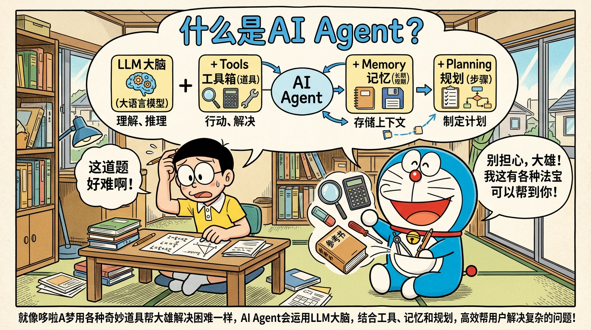
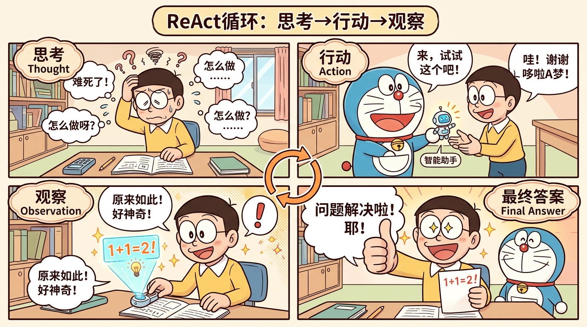
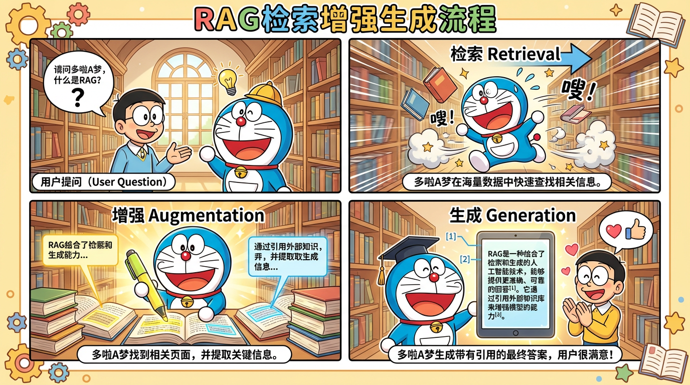

# AI Agent 面试八股文 -- 总目录



> 本目录包含 9 大模块的 AI Agent 面试八股文，覆盖从基础概念到工程实践的完整知识体系。每个模块包含：概念解释、原理详解、面试问题、标准答案、追问应对、代码示例。合计 **200+ 道面试题**。

---

## 模块导航

### 第一部分：核心概念与框架

| 序号 | 模块 | 文件 | 核心内容 | 面试题数 |
|------|------|------|----------|----------|
| 01 | [基础概念](01-基础概念.md) | `01-基础概念.md` | Agent 定义、组成、分类、与 Chain/ChatBot 区别 | 27 题 |
| 02 | [核心框架](02-核心框架.md) | `02-核心框架.md` | ReAct、Plan-and-Execute、Reflexion、LangGraph | 27 题 |

### 第二部分：核心技术

| 序号 | 模块 | 文件 | 核心内容 | 面试题数 |
|------|------|------|----------|----------|
| 03 | [RAG 技术](03-RAG技术.md) | `03-RAG技术.md` | 分块策略、向量数据库、混合检索、重排序、GraphRAG | 24+ 题 |
| 04 | [工具调用](04-工具调用.md) | `04-工具调用.md` | Function Calling、MCP 协议、工具路由、安全 | 17+ 题 |
| 05 | [记忆系统](05-记忆系统.md) | `05-记忆系统.md` | 短期/长期记忆、摘要压缩、记忆检索策略 | 20 题 |
| 06 | [多智能体](06-多智能体.md) | `06-多智能体.md` | 协作模式、通信机制、冲突解决、主流框架 | 20 题 |

### 第三部分：基础与工程

| 序号 | 模块 | 文件 | 核心内容 | 面试题数 |
|------|------|------|----------|----------|
| 07 | [大模型基础](07-大模型基础.md) | `07-大模型基础.md` | Transformer、Attention、KV Cache、LoRA、RLHF/DPO | 28 题 |
| 08 | [工程化实践](08-工程化实践.md) | `08-工程化实践.md` | 模型路由、熔断器、Token 优化、可观测性、部署 | 29+ 题 |
| 09 | [Prompt 工程](09-Prompt工程.md) | `09-Prompt工程.md` | CoT、Few-shot、ReAct 模板、Prompt 注入防御 | 28 题 |

---

## 学习建议

### 如果你是完全的小白（建议顺序）

```
01-基础概念 → 09-Prompt工程 → 03-RAG技术 → 04-工具调用
→ 02-核心框架 → 05-记忆系统 → 06-多智能体
→ 07-大模型基础 → 08-工程化实践
```

### 如果你有一定基础（按优先级）

```
02-核心框架（ReAct 必考） → 03-RAG技术（高频）
→ 04-工具调用（MCP 热点） → 08-工程化实践（企业级加分）
→ 其余模块查漏补缺
```

### 面试前一晚速查

重点复习以下高频考点：
- ReAct 循环（02）
- RAG 完整流程与优化（03）
- MCP vs Function Calling（04）
- 记忆系统设计（05）
- 多 Agent 协作模式（06）
- 三态熔断器（08）
- ReAct Prompt 模板（09）

---

## 漫画图解

本系列八股文配有哆啦 A 梦风格漫画，帮助理解核心概念：

| 漫画 | 对应模块 |
|------|----------|
|  | 02-核心框架：ReAct 循环 |
|  | 03-RAG 技术：检索增强生成 |
|  | 06-多智能体：协作模式 |
|  | 05-记忆系统：短期 vs 长期 |
